# Labbmiljö, Git, CLI och AI
Namn YYY XXX  
Datum 2026-09-NNNNN  
Kursnamn ZZZZZ CANVAS/filer/MYHZZZZZ  
 
Laboration om uppstart för en isolerad virtuell nätverksmiljö med både Windows och Linux (Ubuntu)-maskiner. Inställningar och konfigurationer av angvändargrupper, mappar och behörigheter i PowerShell och Bash samt utförande av nätverkstester med ping. Versionhantering genom av Git som dokumenteras i Markdown. Avslutningsvis utvärdering av AI-verktyget Gemini som kommandoradsstöd.


## Del 1 - Skapa och initiera projektet med Git
### Github
Skapande av ny repository på github.com (lehtela/labb001), anges som Privat.  
Skapande av **C:\GIT\Labb001** och en **testfile.txt** (som senare ska kunna verifiera att att repository fungerar online.)  
PowerShell öppnas i **C:\GIT\Labb001**.  
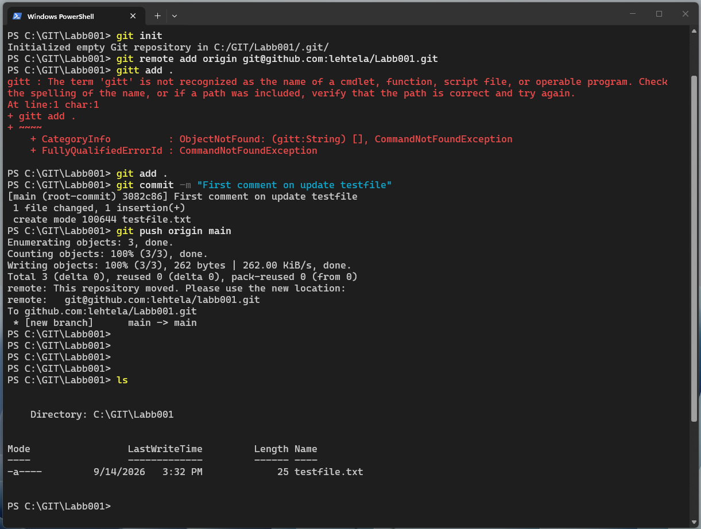
1. Initialisera Git i mappen
>git init 

2. Koppla det lokala projektet till GitHub
>git remote add origin git@github.com:lehtela/Labb001.git 

3. Adderar nya och ändrade filer till staging (mellanlager, förberedelsestadium). Punkten symbolsiserar aktuell katalog med underkataloger.
>git add .  

4. Skapa commit med kommentar/rubrik till uppdatering.
>git commit -m "First comment on update testfile"  

5. Laddar upp och pushar ut filer till GitHub
>git push origin main  


Git initierar och pushar filer till Github, filer veriferas genom webläsare på sidan https://github.com/lehtela/labb001  

### VS Code
I VS Code, öppna **C:\GIT\Labb001** och skapa **Labbdokumentation.md**.  
Filen uppdateras med rubrikinnehåll och rubiker/text. 
Ny commit för att spara arbete online:
>git add .

>git commit -m "Rubriker, spaltindelningar och Del 1"  

>git push origin main  


## Del 2 - Virtuell Labbmiljö och Nätverk
### Tabell över IP-konfigurationer

| Hostname | Operativsystem | IP-adress | Subnätmask | Standard Gateway |
| :--- | :--- | :--- | :--- | :--- |
| Ubuntun-VirtualBox | Ubuntu Desktop | 192.168.1.50 | 255.255.255.0 | Ingen (Host-Only) |
| Windowsen | Windows 11 | 192.168.1.51 | 255.255.255.0 | Ingen (Host-Only) |
| Host-Only Ethernet Adapter #2 | Inte tillgängligt | 192.168.1.1 | 255.255.255.0 | Inte tillgängligt |
- - - 
### VirtualBox
**Konfiguration av två virtuella maskiner i Virtualbox.**  
Det finns två val av konfigurationer mellan de virtuella enheterna, både val isolerar internetåtkomst från de virtuella enheterna.

→ **Internal Network**  
Isolerat nätverk där virtuella enheter kan kommunicera med varandra.  
→ **Host-Only**  
Isolerat nätverk där virtuella enheter kan kommunicera med varandra samt dator som motsvarar host/värd. 
- - - 
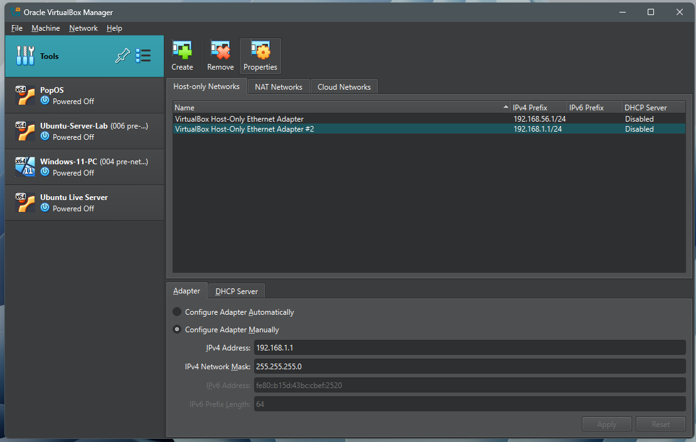
I VirtualBox, **File → Tools → Network** (Ctrl+H) för att skapa adapter.

Skapa ny **Host-only adapter** **"VirtualBox Host-Only Ethernet Adapter #2"**  
Välj **Adapter → Configure Adapter Manually**:  
IPv4 Adress: **192.168.1.1**  
IPv4 Network Mask: **255.255.255.0**
- - - 
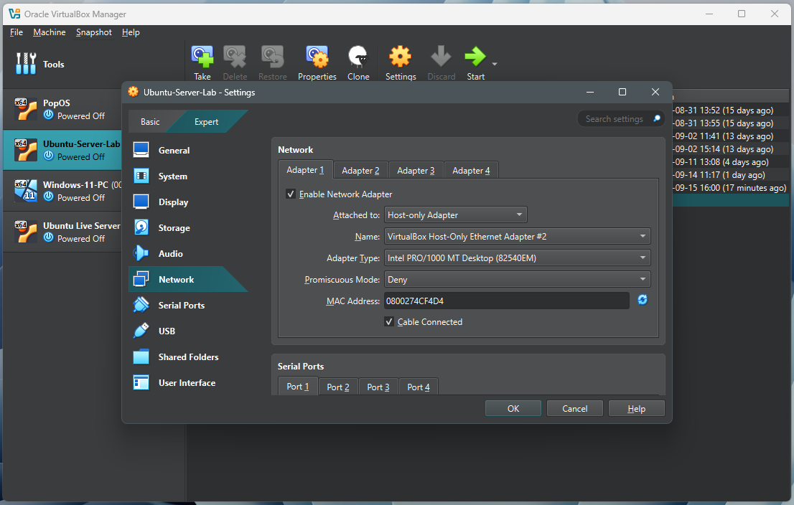
Nästa steg, **välj** adapter för **alla virtuella** enheter:  

Virtuella enhetens inställningar→**Settings→Network→Adapter 1**.  
**Enable Network Adapter 1**  
Attached to: **Host-only Adapter**  
Name: **VirtualBox Host-Only Ethernet Adapter #2**.  
- - -
### Linux Ubuntu Desktop med Host-Only
Starta Ubuntu Desktop VM, hitta **Settings→Network→Wired→IPv4**
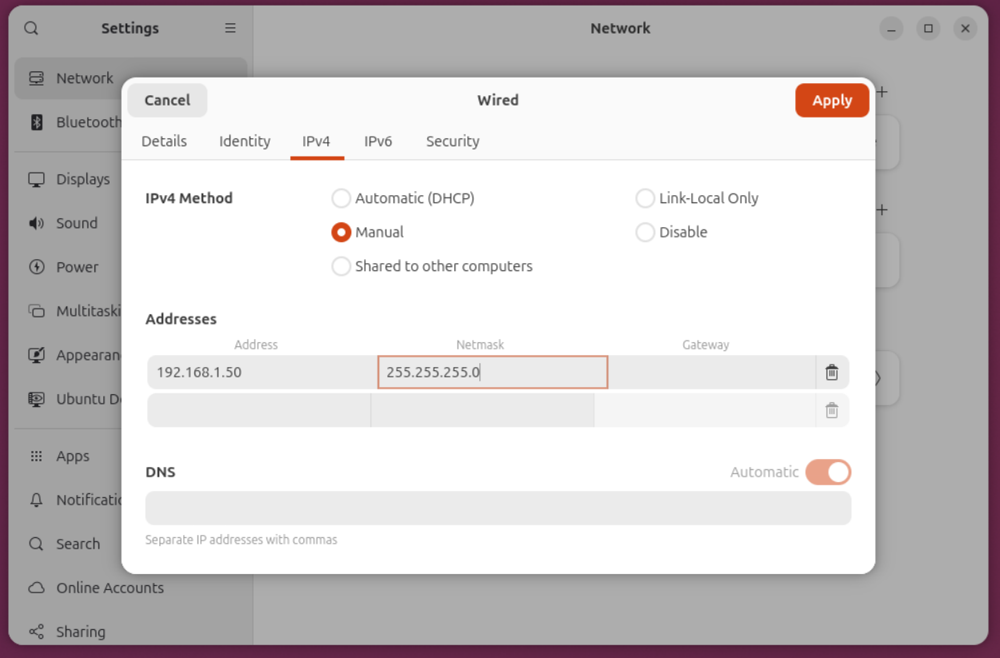
Enable IPv4 Method: **Manual**  
Address: **192.168.1.50**  
Netmask: **255.255.255.0**  
→**Apply**


### Alternativ Terminal konfiguration
Öppna **Terminal** för att ändra nätverksinställningarna manuellt.  
`sudo nano /etc/netplan/00-installer-config.yaml`

Ange värden för fil:
```network:
  ethernets:
    enp0s3:
      dhcp4: false
      addresses:
        - 192.168.1.50/24
      nameservers:
        addresses: [8.8.8.8, 1.1.1.1]
      match:
        macaddress: 08:00:27:4c:f4:d4
      set-name: enp0s3
  version: 2
  ```

Spara fil och applicera inställning:  
`sudo netplan apply`

 - - - 


### Windows 11 med Host-Only
Starta Windows 11 VM, hitta till **Control Panel→Network and Internet→Network Connections** (eller sök efter Network).
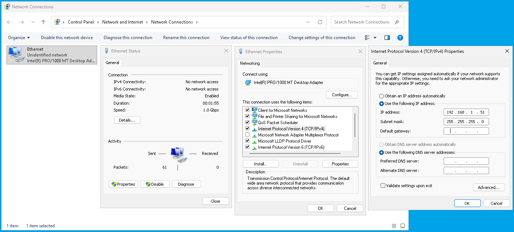
Öppna **"Ethernet Intel(R) PRO/100 MT"→Properties→Networking→Internet Protocol Version 4 (TCP/IPv4)**:  
Ange inställningar:  
IP address: **192.158.1.51**  
Subnet mask: **255.255.255.0**  
→ **OK** 

### Alternativ PowerShell konfiguration
Starta PowerShell med "Run as administrator" och ange
>New-NetIPAddress -InterfaceAlias "Ethernet" -IPAddress "192.168.1.51" -PrefixLength 24

- - -

### Verifiera anslutning med både virtuella enheter 
Öppna vardera PowerShell/Terminal på var sin enhet och använd ping för att säkerställa att enheter når varandra.
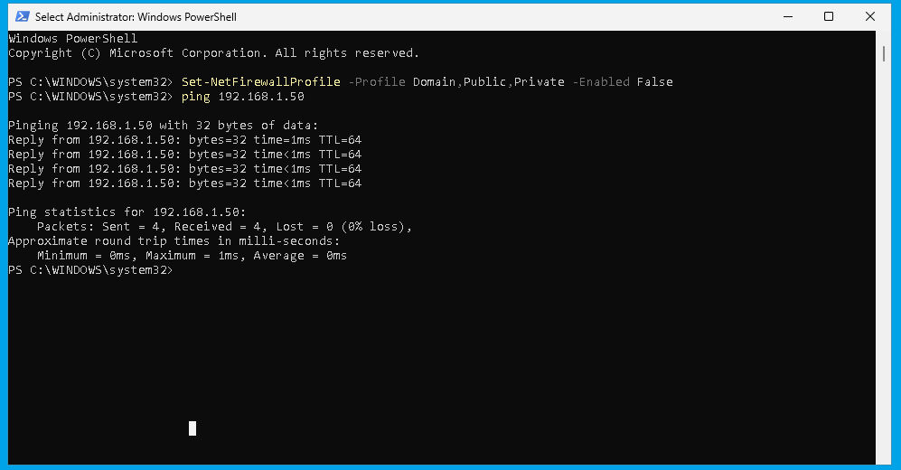  
Windows 11 använder PowerShell/kommandotolken:   
>ping 192.168.1.50
- - - 
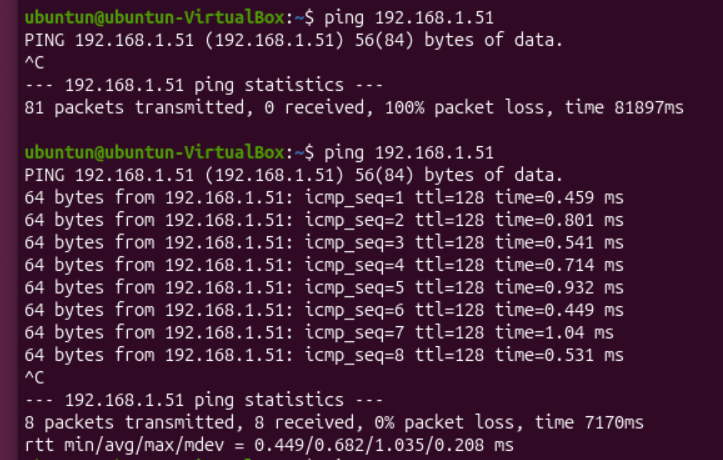  
Ubuntu använder Terminal: 
>ping 192.168.1.51  
- - - 
### När Ubuntu inte når Windows 11 med ping:
**Alternativ 1**   
Öppna PowerShell med "Run as administrator".  
**Stäng ned Windows 11 VM brandvägg:** 
>Set-NetFirewallProfile -Profile Domain,Public,Private -Enabled False  

Stänger ner Windows Defender Firewall som är operativsystemets brandvägg.  
Detta är inte ett rekommenderat val om enheter är anslutna till öppet nät eller Internet, men som fungerar temporärt i sluten testmiljö.
- - - 
**Alternativ 2**  
Öppna PowerShell med "Run as administrator".  
**Tillåt inkommande "ICMP Echo Request"-anrop:**

>New-NetFirewallRule -DisplayName "Tillåt ICMP Inkommande (PING)" -Direction Inbound -Protocol ICMPv4 -IcmpType 8 -Action Allow  

En ny regel under namn "Tillåt ICMP Inkommande (PING)" läggs till i brandväggsinställningar som tillåter ping.
- - - 
**Alternativ 3**  
*<span style="color: red">Obeprövad lösning, använd på egen risk.</span>*  
Öppna Kommandotolken med "Run as administrator". 
>netsh advfirewall firewall add rule name="Tillåt ICMP Inkommande" protocol=icmpv4:8,any dir=in action=allow  

En ny regel under namn "Tillåt ICMP Inkommande" läggs till i brandväggsinställningar som tillåter ping.  

→ **Verifiera med  ping.**  

## Del 3 - Kommandoradsarbete och Felsökning 
### Linux med Bash
**Skapa kataloger och filer samt ändra behörigheter:**  
Öppna Terminal 

Skapa mappar **/systemmentor/konsultdata**  
`sudo` ger administrationsrättigheter (superuser do) för att skriva i "systemfiler" såsom `/var/`  
`-p` ger förmågan att skapa mappar-i-mappar, hierarkier.  

>sudo mkdir -p /var/systementor/konsultdata  


Förflytta position till skapad mapp.
>cd /var/systementor/konsultdata

Skapa **anteckningar.txt**.  
`touch` skapar text-fil. 
>sudo touch anteckningar.txt  

Lista filer med behörigheter/egenskaper. `-la` visar alla filer (även dolda filer som börjar med ".punkt").
>ls -la 
- - - 

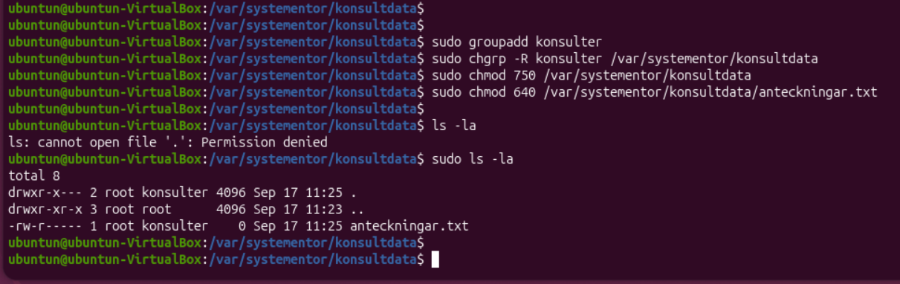
Skapa gruppnamn **konsulter**
>sudo groupadd konsulter  

**Ändra ägandegrupper**   
`chgrp` ändrar detta för olika filer och kataloger.  
`-R` ger hela katalogstrukturen med underliggande filer tilldelas samma värde.
>sudo chgrp -R konsulter /var/systementor/konsultdata  

**Applicera "least privilege"-principen** till kataloger och filen anteckningar.txt  
`chmod` (change mode) används för ändra behörigheter (läsa, skriva, köra).  
`750` ger ägare full kontroll, grupp läs/kör och stänger ute andra användare.  
`640` ger ägare läs/skriv, grupp läs och stänger ute andra användare.  
>sudo chmod 750 /var/systementor/konsultdata  
>sudo chmod 640 /var/systementor/konsultdata/anteckningar.txt  

**Lista filer med behörigheter**  
För att verifiera att värden är utefter önskade värden.  
>sudo ls- la

Katalog `drwxr-x--- (750)` tillhör ägare root och grupper konsulter.  
Fil anteckningar.txt `-rw-r----- (640)` och tillhör ägare root och grupper konsulter.
- - - 

### Windows med PowerShell
Starta PowerShell med "Run as administrator".
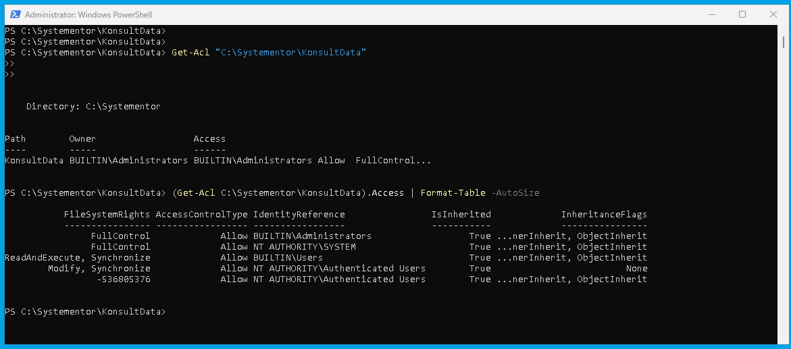
**Skapa kataloger och filer samt läsa behörigheter:**  
Skapa katalog KonsultData i Systementor.  
`New-Item` skapar nytt objekt.  
`-ItemType Directory` bestämmer vilken typ av föremål; directory/mapp.  
`-Path` bestämmer destination.  
>New-Item -ItemType Directory -Path "C:\Systementor\KonsultData"  

Läs behörigheter över katalog med hjälp av Access Control List:  
Förenklad vy:
>Get-Acl

Utökad vy:
>(Get-Acl C:\Systementor\KonsultData).Access | Format-Table -AutoSize

Verifiera inställningar.

I jämförelse med Ubuntu-VM så är Windows standardinställningar mer öppna och för alla typer av användare, har inte "least privileger" som standard.

- - - 
## Verifiera VM-enheter med ping
### Ubuntu-Desktop VM
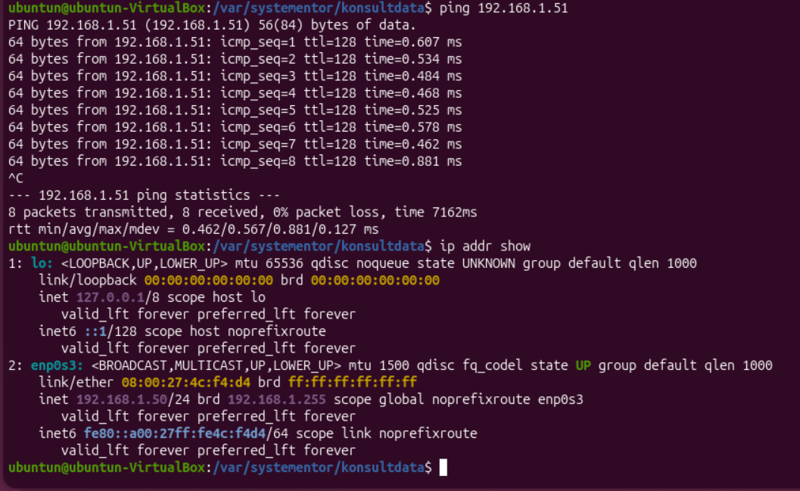
Verifiera nätverksanslutning från Ubuntu-VM till Windows-VM samt nätverkskortets detaljer för Ubuntu-VM.
>ping 192.168.1.51  
>ip addr show  
 
### Windows VM
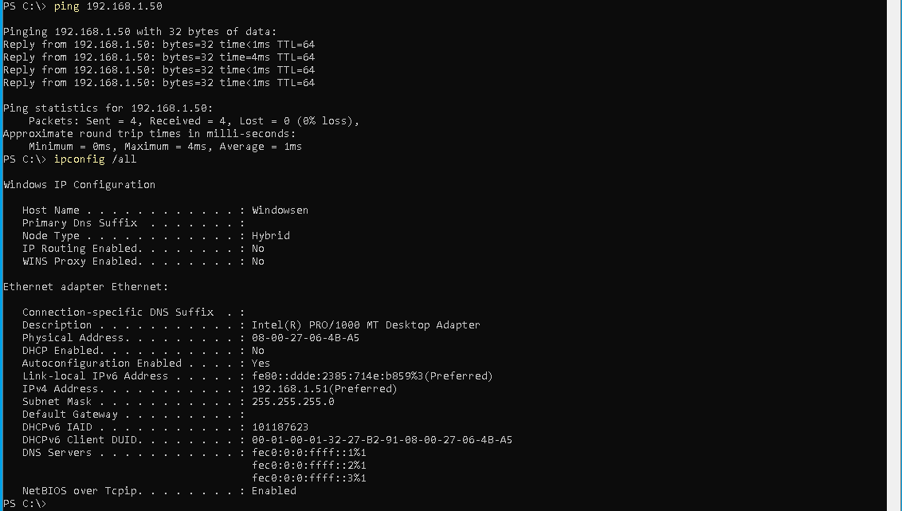
Verifiera nätverkanslutningen från Windows-VM till Ubuntu-VM genom ping samt visa nätverksinställningar:
>ping 192.168.1.50  
>ipconfig /all  


## Del 4 - AI-logg och Utvärdering:  


Jag har valt att använda Google Gemini som är ett generativt AI-verktyg som ska hjälpa mig med att utförligt stödja och hjälpa mig med
kommandorader för att skapa en ny katalog i PowerShell (Windows).

Jag:
>Jag är studerande på YH-skola mot IT och jag vill att du agerar lärare till mig. Jag behöver hjälp att förstå och lära mig, jag har tidigare inte gjort detta och jag vill att du förklarar på ett enkelt sätt. Bryt gärna ned svaret i steg med förklarande texter.
Här är min uppgift:
Hur skapar jag en mapp i PowerShell win11?

Gemini:
>Hej! Kul att du pluggar IT. Att skapa en mapp via PowerShell är enkelt när man lär sig grundkommandona.
Här är en snabb genomgång:
Steg 1: Öppna PowerShell
Tryck på Windows-tangenten, sök efter PowerShell och tryck Enter. Det öppnar gränssnittet där du kan skriva dina kommandon.
Steg 2: Gå till rätt plats (Valfritt)
Använd kommandot cd följt av sökvägen (t.ex. cd C:\Users\DittNamn\Desktop) för att välja var mappen ska ligga. Om du inte gör detta skapas mappen i din standardmapp.
Steg 3: Skapa mappen
Skriv kommandot New-Item -ItemType Directory -Name "MinMapp" och tryck Enter. Alternativt kan du använda det kortare kommandot mkdir "MinMapp".
Vill du testa att skapa en fil i mappen också?

Jag:
>Vad betyder "New-Item -ItemType Directory -Name "MinMapp""? 

Gemini:
>New-Item: Själva kommandot som talar om för PowerShell att du vill skapa något nytt (t.ex. en fil eller en mapp).
-ItemType Directory: En parameter som bestämmer vad du vill skapa. Directory betyder att det ska vara en mapp (katalog) istället för en vanlig fil.
-Name "MinMapp": Anger namnet på det du skapar, här blir mappen hetande "MinMapp".

Jag:
>vilka fler liknande kommandon i PowerShell kan vara viktigt för mig att känna till, exempelvis när jag skapar mappar? 

Gemini:
>mkdir: En genväg för att snabbt skapa nya mappar direkt utan att skriva hela New-Item.
Remove-Item: Används för att radera mappar eller filer (motsvarar rm i Linux).
Set-Location (eller cd): Används för att byta till en annan mapp.

Jag:
>Vad är cd förkortning av? 

Gemini:
>cd är en förkortning av Change Directory. Det används för att byta till en annan mapp i terminalen.

Jag:
>varför finns det flera kommandon för samma typ av händelser? borde inte Set-Location ha en förkortning mer lik SL än CD?

Gemini:
>PowerShell har flera kommandon för samma sak (så kallade alias) för att underlätta för användare vana vid antingen Windows CMD eller Linux. Roligt att du tänker på det – Set-Location har faktiskt sl som ett inbyggt alias, precis som cd!

Jag:
>Varför nämnde du inte SL som första alternativ? Varför nämna CD senare? och inte alls SL förrän jag frågar efter detta? 

Gemini:
>cd nämndes först eftersom det är den absolut vanligaste standarden i alla terminaler. sl utelämnades eftersom det i praktiken nästan aldrig används av utvecklare, även om det finns som ett inbyggt alias. Jag ville fokusera på de kommandon du har störst nytta av direkt.

Jag:
>vad är historien bakom CD vs Set-Location/SL? Varför finns flera kommandon för samma ärende? 

Gemini:
>PowerShell använder en egen standard med tydliga namn som Set-Location, men lade till inbyggda genvägar (alias) för att underlätta övergången från äldre system. Genvägen cd lades till för att MS-DOS- och Linux-användare direkt skulle känna igen sig, medan sl är den logiska förkortningen av systemets eget namn. Syftet med flera kommandon är alltså enbart att göra terminalen användarvänlig för alla, oavsett vilken IT-bakgrund du har.

Jag:
>Ge mig fler tips på användbara kommandon som man bara måste behärska i vardagen. 

Gemini:
>pwd: Visar din nuvarande sökväg så du vet var du är.
Clear-Host (eller cls): Rensar skärmen när den blir full av text.
Get-Content (eller cat): Läser och visar innehållet i en fil direkt i terminalen.

Jag:
> hur skapar jag filer? 

Gemini:
>New-Item: Skapar en ny tom fil om du anger -ItemType File, till exempel New-Item -ItemType File -Name "fil.txt". echo eller omdirigering (>): Skapar en fil med text direkt, till exempel echo "Hej" > fil.txt.

**Slutsats och Reflektion**  
Svar som Gemini ger mig är tillräckligt för att lösa min uppgift, att skapa ny mapp. Den talar om vad olika kommandon betyder och vad deras funktioner innebär, särskilt när man ställer direkta följdfrågor. Kommandon som ofta används har även fått förkortningar till sig, att istället skriva "Set-Location" kan förkortningen "cd" användas som är en förkortning av 'Change Directory'. Jag säkerställer att det AI har lärt mig är rätt genom att själv prova och skapa mapper i PowerShell i testmiljö som en virtuell maskin för Windows 11.

Efter fler följdfrågor kommer fler svar fram, man kan tycka att Gemini skulle ha berättat för mig om kommandot SL tidigare men Gemini nämner om att SL inte är ett standardiserat kommando. De är enklare att minnas förkortningar samt enklare att skriva än "Set-Location", som nybörjare eller studerande kan detta skapa förvirring i vad det är som gäller, ska man lita på att AI-verktyg bedömmer rätt åt en? 
Detta skulle kunna innebära säkerhetsrisker i aktiva IT-miljöer då AI-verktyg kan filtrera bort kritisk information som användare värderar. Särskilt i tidigare skede under dokumentation gav AI-verktyget ett enda förslag som handlade om att stänga ner Windows Defender Firewall för att nå anrop med ping, utan att benämna risker.

Slutsats att dra är att Gemini inte verkade hallucinera vid frågeställningar, kanske att verktyget valde bort information som inte tycktes vara viktigt, egna antaganden, som ledde till flera följdfrågor från användaren. Annarsvis var kod korrekt men smalt uttryckt, det saknas bredd samt exempelvis alternativa vägar som ibland skulle kunna vara bättre.