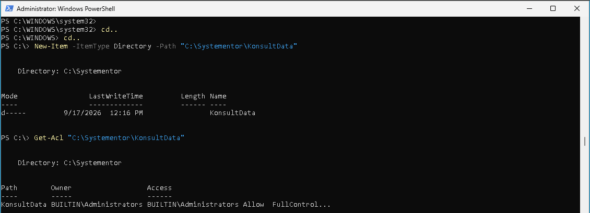

# Labbmiljö, Git, CLI och AI
Namn Efternamn  
Datum xxxx-xx-xx  
Kursnamn xxx  
Beskrivning av labbmiljö  

## Del 1 Skapa och initiera projektet med Git (Kursmål 10)
Skapande av ny repository på github.com under lehtela/labb001, anges som Privat.  
Skapande av C:\GIT\Labb001 och en testfile.txt som ska kunna verifiera att att repository fungerar.  
Terminal öppnas i C:\GIT\Labb001.  

>"git init"  
>"git remote add origin git@github.com:lehtela/Labb001.git"  
>"git add ."  
>"git commit -m "First comment on update testfile"  
>"git push origin main"  


Git laddar och pushar upp filer till Github, filer veriferas genom webläsare på sidan https://github.com/lehtela/labb001  

VS Code startas och ställs i folder C:\GIT\Labb001, skapande av Labbdokumentation.md göres samt filen uppdateras med rubrikinnehåll och uppgiften Del 1.  
En ny commit göres för att uppdatera arbete.
>"git add ."  
>"git commit -m "Rubriker, spaltindelningar och Del 1"  
>"git push origin main"  


## Del 2 Virtuell Labbmiljö och Nätverk (Kursmål 8)  
### Konfiguration av två virtuella maskiner i Virtualbox.
Det finns två val av konfigurationer mellan de virtuella enheterna, både val isolerar internetåtkomst från de virtuella enheterna.

*Internal Network  
Isolerat nätverk där virtuella enheter kan kommunicera med varandra.  
*Host-Only  
Isolerat nätverk där virtuella enheter kan kommunicera med varandra samt dator som motsvarar host/värd. 

### Skapa adapter i VirtualBox:  

Öppna VirtualBox, välj File>Tools>Network (Ctrl+H)  
Skapa ny Host-only adapter "VirtualBox Host-Only Ethernet Adapter #2"  
Välj flik Adapter och Configure Adapter Manually:  
IPv4 Adress: 192.168.1.1  
IPv4 Network Mask: 255.255.255.0  


Nästa steg är att välja denna adapter för alla de virtuella enheterna:  
Välj de virtuella enheterna i VirtualBox du vill sammankoppla till Host-Only-adaptern:
Settings/Network/Adapter 1.
Enable Adapter 1.
Attached to: Host-only Adapter
Name: VirtualBox Host-Only Ethernet Adapter #2.  

### *Linux med Ubuntu Desktop med Host-Only

Starta Ubuntu Desktop VM.

Sök i meny efter "settings"  
Network/Wired/IPv4

[x] ]Manual  
Address: 192.168.1.50  
Netmask: 255.255.255.0  

### *Windows 11 med Host-Only

Starta Windows 11 VM.
Sök i startmeny efter "view network connections".  
Öppna "Ethernet Intel(R) PRO/100 MT"/Properties/Networking/Internet Protocol Version 4 (TCP/IPv4):  
 
IP address: 192.158.1.51  
Subnet mask: 255.255.255.0  

### Kommande uppdatering: Terminal och PowerShell konfigurationer
Genvägar för konfigirationer nås genom Terminal och PowerShell-kommandon.  

### Att verifiera anslutning med ping
  
Windows 11
PowerShell/kommandotolken: ping 192.168.1.50

  
Ubuntu
Terminal: ping 192.168.1.51  

Vid tillfälle om Ubuntu inte når Windows 11 med ping:
Stäng ned Windows 11 VM brandvägg:  
Terminal med "Run as administrator":  
```Set-NetFirewallProfile -Profile Domain,Public,Private -Enabled False``` stänger ner Windows egna brandvägg.  
Verifiera med ping.

### Tabell över konfiguration

| Hostname | Operativsystem | IP-adress | Subnätmask | Standard Gateway |
| :--- | :--- | :--- | :--- | :--- |
| Ubuntun-VirtualBox | Ubuntu Desktop | 192.168.1.50 | 255.255.255.0 | Ingen (Host-Only) |
| Windowsen | Windows 11 | 192.168.1.51 | 255.255.255.0 | Ingen (Host-Only) |


## Del 3 Kommandoradsarbete och Felsökning (Kursmål 9)  
### * Linux (Bash)  
Skapa kataloger och filer och ändra behörigheter:

>sudo mkdir -p /var/systementor/konsultdata  
-p gör att undermappar i mappen kan skapas.
sudo" ger tillfälliga administrationsrättigheter för att skriva i mappar såsom /var/

>cd /var/systementor/konsultdata
förflytta dig till konsultdata-katalogen

>sudo touch anteckningar.txt  
skapar txtfil i mapp vi står i

>ls -la
listar alla filer och mappar i kataloger samt behörighetsinformation och egenskaper.  
  
skapar gruppnamn konsulter
>sudo groupadd konsulter  

chgrp ändrar ägandegrupp för olika filer eller kataloger.
-R gör att hela katalogstrukturen och underliggande filer tilldelas samma värde.
>sudo chgrp -R konsulter /var/systementor/konsultdata  

applicerar "least privilege"-principen till kataloger och filen anteckningar.txt
>sudo chmod 750 /var/systementor/konsultdata  
>sudo chmod 640 /var/systementor/konsultdata/anteckningar.txt  

Hjälper oss verifiera att rättigheter är efter önskade värden.
katalog "drwxr-x--- (750)" tillhör ägare root och grupper konsulter.
fil anteckningar.txt "-rw-r---- (640) och tillhör ägare root och grupper konsulter.
>sudo ls- la  


Verifiera nätverksanslutning till Windows-VM samt nätverkskortets detaljer för Ubuntu-VM.
>ping 192.168.1.51  
>ip addr show  


### * Windows (PowerShell)  

Starta PowerShell med administratörsrättigheter.

Skapa katalog KonsultData i Systementor.
New-Item skapar nytt objekt, -ItemType Directory bestämmer vilken typ av föremål och -Path bestämmer destination.
>New-Item -ItemType Directory -Path "C:\Systementor\KonsultData"  

Läs behörigheter över katalog med hjälp av Access Control List. 
>Get-Acl "C:\Systementor\KonsultData"


Verifikera nätverkanslutningen till Ubuntu-Vm genom ping samt visa nätverksinställningar:
>ping 192.168.1.50  
>ipconfig /all

## Del 4: AI-stöd och Kritisk Utvärdering (Kursmål 11)  


## AI-logg och Utvärdering:  
